# Cybersecurity Lab Setup — VirtualBox & Kali Linux

**NetworkWalks Academy | Cybersecurity Internship | Week 1 — Project Module 1 (WK1-PM1)**

---

## 📌 Project Overview

This project documents the setup of a **virtual cybersecurity and penetration-testing laboratory** built using Oracle VirtualBox and Kali Linux.

The goal is to create an isolated, controlled environment on a personal laptop/PC where security tools, network scanning, reconnaissance, and other hands-on cybersecurity exercises can be practiced safely — without exposing the host machine or home network to risk.

The lab runs on a dedicated, custom **NAT Network** (`10.0.0.0/24`) so that additional victim/target machines (Windows, Server, Android, etc.) can be added later and communicate with the Kali attack box.

---

## 🎯 Objectives

- Install 7-Zip (required to extract the Kali Linux VM archive).
- Install the latest recommended version of VirtualBox.
- Create and configure a custom **NAT Network** in the subnet `10.0.0.0/24`.
- Download and import the Kali Linux pre-built VirtualBox VM.
- Enable clipboard sharing, drag-and-drop, and a shared folder between host and VM.
- Assign Kali Linux a static IP address of `10.0.0.2/24`.
- Verify full Internet access and DNS resolution from Kali.
- Take a clean snapshot of the VM once networking is confirmed working.
- Document issues encountered and their fixes for future reference.

---

## 🛡️ Purpose of the Lab

This lab provides an isolated environment for cybersecurity learning and **authorized** security testing, including:

- Network reconnaissance and enumeration
- Port and vulnerability scanning
- Packet capture and analysis
- Web application security testing
- Exploitation and post-exploitation practice
- General experimentation with offensive security tools

⚠️ **Important:** This lab must only be used against systems you own or have explicit written permission to test. Do not use it to attack unauthorized networks or systems.


---

## ⚙️ Lab Configuration

| 🧩 Component | ⚙️ Configuration |
|---|---|
| 🖥️ Host OS | Windows |
| 🧰 Hypervisor | Oracle VirtualBox (latest recommended) |
| 📦 Archive Tool | 7-Zip 26.03 |
| 🐉 Attack Machine | Kali Linux 2026.2 (64-bit) |
| 🧠 Kali Base Memory | 2048 MB |
| ⚙️ Kali Processors | 2 |
| 💾 Kali Disk | 80.09 GB (VDI, SATA) |
| 🌐 Virtual Network | Custom NAT Network — `NatNetwork` |
| 📡 Network Subnet | `10.0.0.0/24` |
| 🐧 Kali IP Address | `10.0.0.2/24` |
| 🚪 Gateway | `10.0.0.1` |
| 🌍 DNS Server | `8.8.8.8` (fallback: `10.0.0.1`) |
| 📂 Shared Folder | `Downloads` → mounted from host `Downloads` folder |
| 🔮 Future VM IP Range | `10.0.0.3 – 10.0.0.99` |

---

# 🪜 Lab Setup Procedure

## Step 1. Install 7-Zip

7-Zip was downloaded and installed to handle extraction of the Kali Linux VM archive.

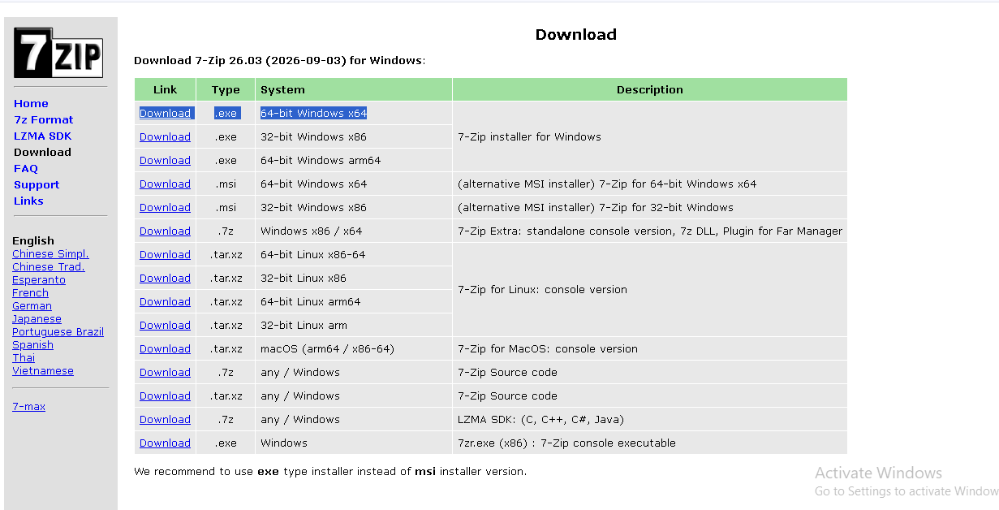

**Source:** https://7-zip.org/download.html


---

## Step 2. Install VirtualBox

The latest recommended version of Oracle VirtualBox was downloaded and installed as the hypervisor, along with the matching Extension Pack.

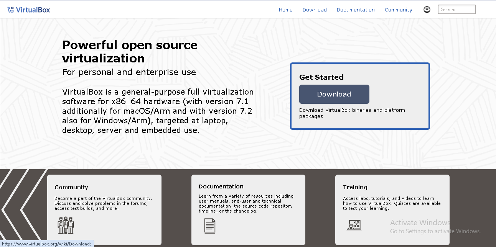

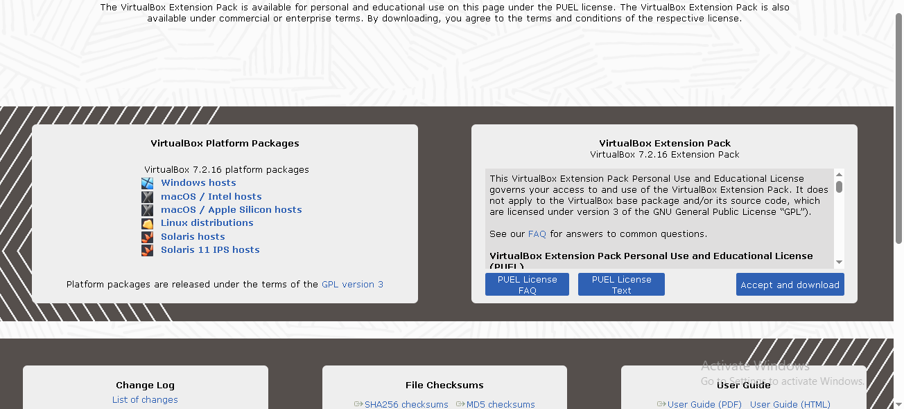

**Source:** https://virtualbox.org/wiki/Downloads

---

## Step 3. Create the Custom NAT Network

A dedicated **NAT Network** was created inside VirtualBox via **File → Tools → Network → NAT Networks**.

Configuration used:

```
Name:          NatNetwork
IPv4 Prefix:   10.0.0.0/24
DHCP:          Enabled
IPv6:          Disabled
```

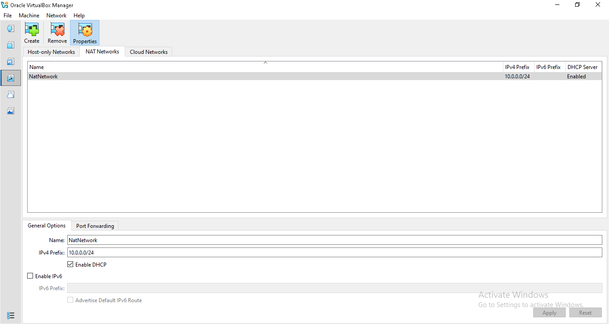

A **NAT Network** (rather than plain NAT) was chosen because it allows multiple VMs attached to the same network to communicate with each other while still providing outbound Internet access — essential for building a multi-machine lab.

---

## Step 4. Download and Import Kali Linux

The Kali Linux pre-built VirtualBox VM was downloaded from the official Kali site and Extract the downloaded archive if required and import the Kali Linux VM into VirtualBox.

**Source:** https://kali.org/get-kali

VM settings configured after import:

The VM's network adapter was set as follows:
```
Network (Adapter 1):
  Enable Network Adapter: Yes
  Attached to:             NAT Network
  Name:                    NatNetwork
  Adapter Type:            Intel PRO/1000 MT Desktop (82540EM)
  Promiscuous Mode:        Allow All
  Cable Connected:         Yes
```
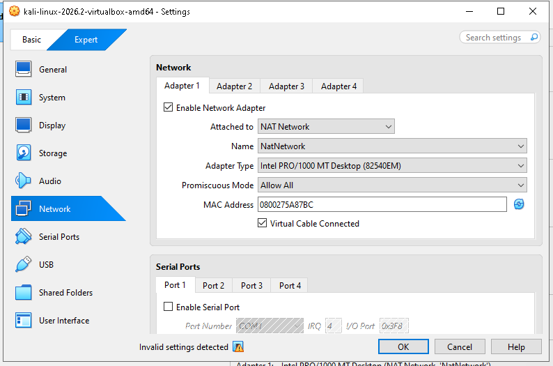

Allocated resources:
```
  OS Type:        Debian (64-bit)
  Base Memory:    2048 MB
  Processors:     2
```
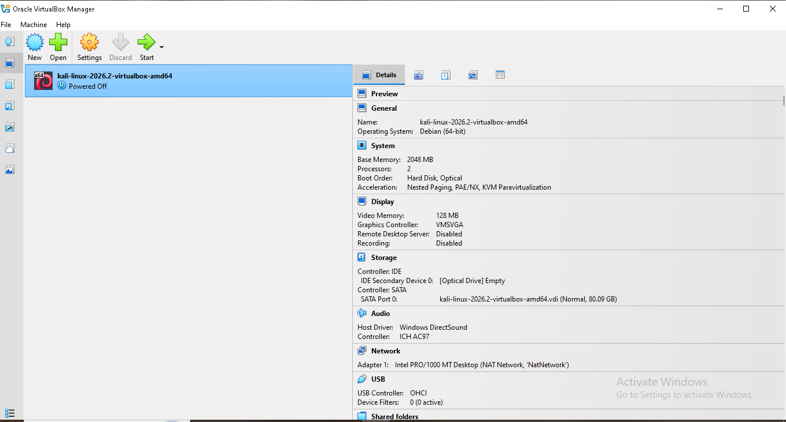

The VM was powered on and reached the Kali desktop successfully.

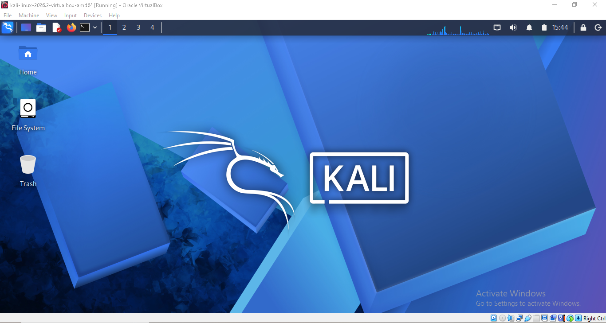

---

## Step 5. Configure the Kali Linux IP Address

Inside Kali, the network connection was edited manually via **Network Manager → Wired connection 1 → IPv4 Settings**:

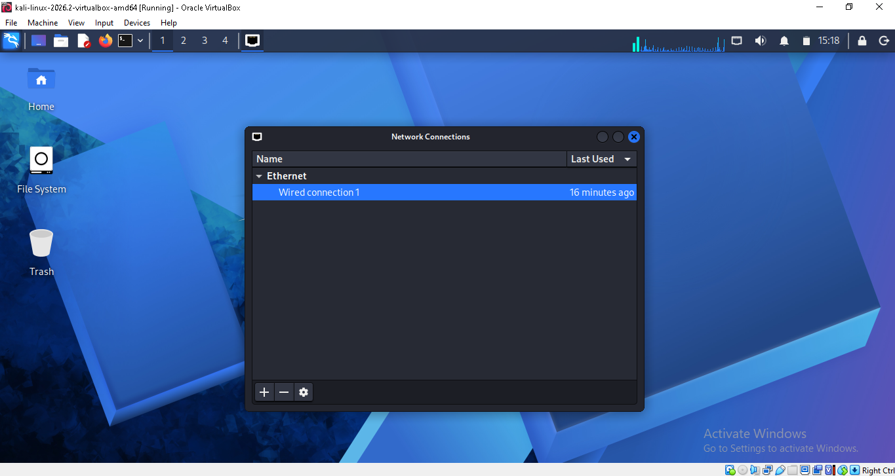

```
Method:        Manual
Address:       10.0.0.2
Netmask:       24
Gateway:       10.0.0.1
DNS servers:   8.8.8.8   (use 10.0.0.1 if Internet access has issues)
```

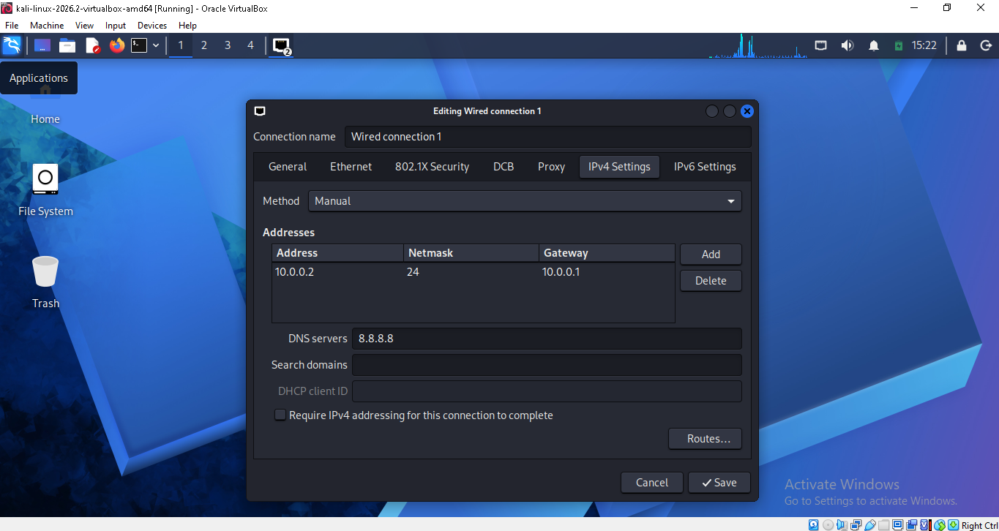

The connection was then taken down and brought back up to apply the new settings:

```
sudo nmcli connection down "Wired connection 1"
sudo nmcli connection up "Wired connection 1"
```
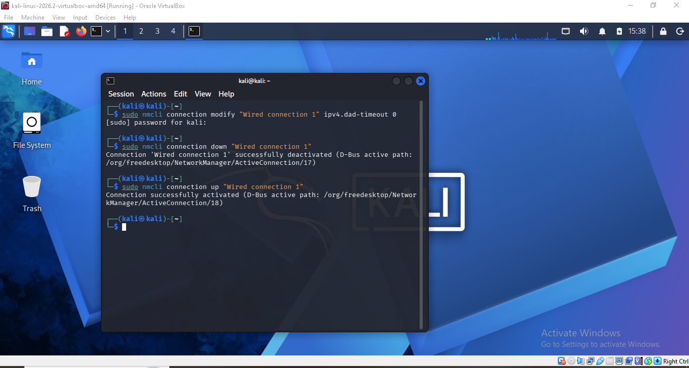

Internet access was then confirmed by opening Firefox inside Kali and successfully loading a web page.

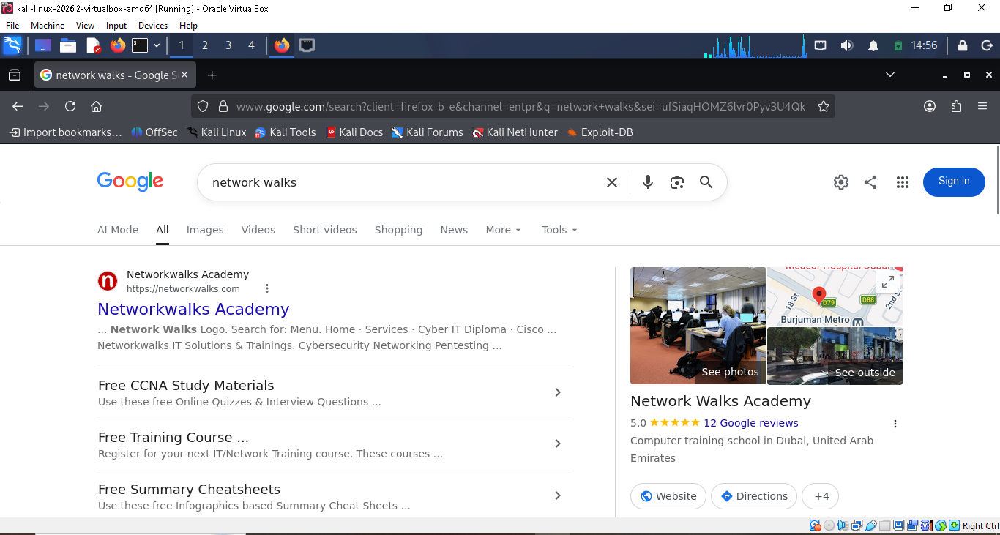

---

## Step 6. Take a Snapshot

Once networking was confirmed working, a snapshot was taken in VirtualBox to preserve a clean, known-good baseline:

```
Snapshot Name: First Kali - Network Configured
```
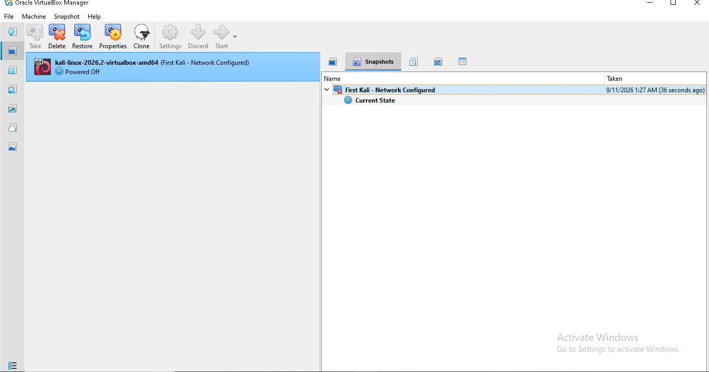

This snapshot can be restored at any time if the VM is broken during future exercises.

---

# 🔎 Lab Verification

| ✅ Test | 🧾 Command | 🎯 Expected Result |
|---|---|---|
| 🌐 Check IP address | `ip a` | Shows `10.0.0.2/24` on the wired interface |
| 📡 Test gateway | `ping 10.0.0.1` | Successful replies |
| 🌍 Test Internet connectivity | `ping 8.8.8.8` | Successful replies |
| 🔎 Test DNS resolution | Browse/search in Firefox (e.g. Google) | Pages load correctly |
| 🔄 Verify snapshot | Restore snapshot and re-check `ip a` | Baseline network config restored |

---

# 🐞 Problems Encountered & Solutions

## Problem 1. No Internet Access After Static IP Configuration

This is a known, common issue on **VirtualBox v7** with **Kali Linux 2026.1 and newer**, related to how NetworkManager handles duplicate-address detection (DAD) on manually configured interfaces.

**Fix used:**

```
sudo nmcli connection modify "Wired connection 1" ipv4.dad-timeout 0
sudo nmcli connection down "Wired connection 1"
sudo nmcli connection up "Wired connection 1"
```

If the issue persists:

1. Confirm the `NatNetwork` was created correctly with prefix `10.0.0.0/24`.
2. Confirm no other VM on the same NAT Network is also using `10.0.0.2`.
3. Restart the Kali VM after running the commands above.
4. Restart all VMs and the host machine if the problem continues.

> **Note:** Connection names (e.g. `"Wired connection 1"`) may differ between systems — verify the actual connection name with `nmcli connection show` before running the fix commands.
>

## Problem 2. VM Fails to Start (Virtualization Not Enabled

When starting the Kali VM, VirtualBox displays an error indicating that hardware virtualization (VT-x on Intel or AMD-V on AMD) is not available or not enabled, and the VM refuses to boot.

It causes due to Hardware virtualization is typically disabled by default in the system BIOS/UEFI, or is being blocked by another hypervisor (e.g., Hyper-V or WSL2) running on the host at the same time.

**Fix used:**

1.Restart the host and enter BIOS/UEFI(commonly F2, F10, F12, Del, or Esc depending on the manufacturer).

2.Enable Intel VT-x or AMD-V / SVM Mode.

3.Save and exit.

4.On Windows, if it still fails, disable Hyper-V/WSL2 via Turn Windows features on or off.

5.Restart and start the Kali VM again.

---

# 💡 What I Learned

### 1. NAT vs. NAT Network
A standard NAT adapter isolates each VM from the others, while a **NAT Network** lets multiple VMs on the same virtual network talk to each other *and* reach the Internet — which is what a multi-machine lab needs.

### 2. Static IP Configuration in Kali
Learned how to manually configure IPv4 address, netmask, gateway, and DNS settings through the Network Manager GUI and verify them with `nmcli`.

### 3. Troubleshooting VM Networking
Learned how DAD timeout settings in NetworkManager can silently block connectivity after switching from DHCP to a manual/static IP, and how to resolve it with `nmcli`.

### 4. VM Snapshots
Learned to snapshot the VM immediately after a working configuration is reached, providing a safe rollback point before installing tools or running risky exercises.

### 5. Documentation Discipline
Learned the value of documenting each configuration step, screenshot, and troubleshooting fix for repeatability and for helping others facing the same issues.

---

# 🔐 Security & Ethical Use

This lab is intended **strictly for educational and authorized testing purposes**. Do not use any tools or techniques practiced in this environment against systems or networks you do not own or do not have explicit permission to test.

---

# 🔗 Tools & Reference

- **7-Zip:** https://7-zip.org/download.html
- **VirtualBox:** https://virtualbox.org/wiki/Downloads
- **Kali Linux:** https://kali.org/get-kali
- **Github Repo Guide:**https://github.com/waqaskarimccie/NETWORKWALKS-B082-WK1-PM1-CYBERSECURITY-LAB-SETUP
  

---

## Author

**Kritika Rai**
Batch: B083 — NetworkWalks Cybersecurity Internship

- LinkedIn: [https://in.linkedin.com/in/kritika-rai-b46259406]
- GitHub: [your GitHub URL]
